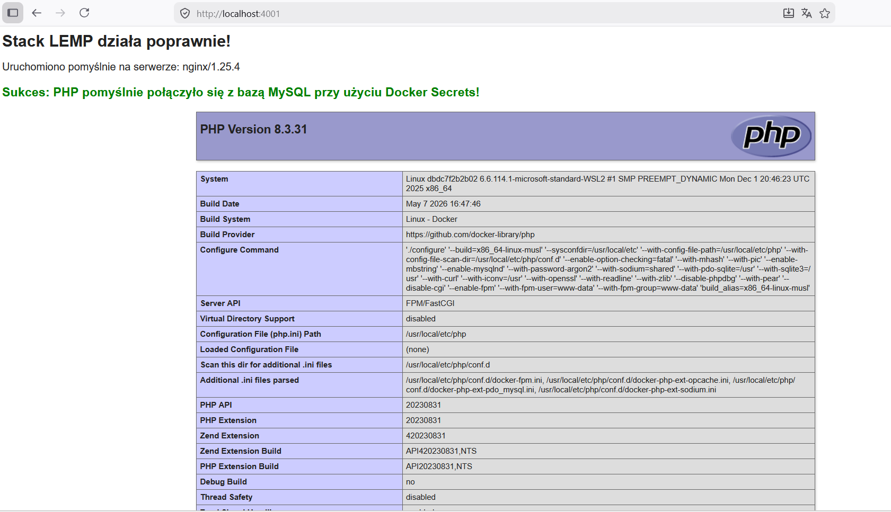
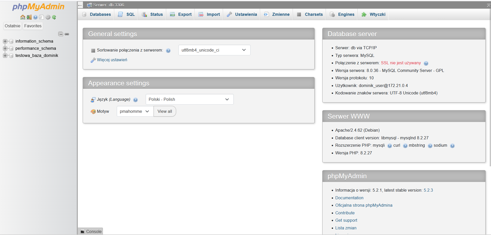

**Laboratorium 14 & 14D: Architektura wielokontenerowa LEMP i Docker Secrets**

Autor: **Dominik Błaziak**

### ZADANIE OBOWIĄZKOWE (Laboratorium 14)

**Architektura i segmentacja sieciowa stacku LEMP**

Aplikacja składa się z czterech odrębnych kontenerów (mikrousług):

* **Nginx** (kontener o nazwie `nginx`): Wydajny serwer WWW, który działa jako Reverse Proxy.
* **PHP-FPM** (kontener o nazwie `php`): Interpreter procesów odpowiedzialny za dynamiczne wykonywanie skryptów PHP.
* **MySQL** (kontener o nazwie `mysql`): Relacyjny silnik bazy danych do składowania danych aplikacji.
* **phpMyAdmin** (kontener o nazwie `phpmyadmin`): Graficzny interfejs webowy służący do administracji bazą danych.  


**Uzasadnienie topologii sieciowej oraz przynależności serwera phpMyAdmin**

Zgodnie z wymaganiami projektowymi, sieć została podzielona na dwie odizolowane strefy za pomocą domyślnego sterownika bridge:  

* **Sieć backend:** Służy do bezpiecznej komunikacji wewnętrznej. Przypisane są do niej kontenery `php` oraz `db`. Ich porty wewnętrzne (odpowiednio 9000 oraz 3306) zostały całkowicie odizolowane od systemu operacyjnego hosta za pomocą dyrektywy `expose`. Uniemożliwia to bezpośredni atak na bazę lub interpreter z zewnątrz.  

* **Sieć frontend:** Służy do przyjmowania ruchu użytkowników z poziomu przeglądarki. Serwer WWW Nginx mapuje ruch z bezpiecznego portu hosta 4001 na port 80 wewnątrz kontenera, dzięki czemu aplikacja jest dostępna dla świata. 

Kontener `phpmyadmin` został celowo dołączony do obu sieci jednocześnie (frontend oraz backend). Wynika to z faktu, że aplikacja ta musi pełnić rolę **pomostu architektonicznego** w systemie:  

* Poprzez **sieć frontend** umożliwia administratorowi zmapowanie dedykowanego portu 6001 na port 80 kontenera, dzięki czemu uzyskujemy dostęp do interfejsu graficznego panelu w przeglądarce.  

* Poprzez jednoczesną przynależność do **sieci backend**, phpMyAdmin zyskuje wewnętrzny, bezpieczny dostęp do kontenera bazy danych (`mysql`) na porcie 3306. Pozwala to na pomyślną autoryzację, zarządzanie tabelami i przesyłanie kwerend SQL, bez wystawiania samej bazy danych bezpośrednio na świat.

### Wykaz użytych poleceń wraz z wynikami działania

**1. Uruchomienie usług w trybie odizolowanym (detach)**

Uruchomienie całego stacku kontenerów LEMP wraz z phpMyAdmin za pomocą jednego polecenia w katalogu projektu:  

```bash
     docker compose up -d
```

```bash
     [+] up 67/67
 ✔ Image nginx:1.25.4-alpine         Pulled                                                                             44.2s
 ✔ Image phpmyadmin:5.2.1            Pulled                                                                             82.1s
 ✔ Image php:8.3-fpm-alpine          Pulled                                                                             31.3s
 ✔ Image mysql:8.0.36                Pulled                                                                             61.8s
 ✔ Network lab14-stack-lemp_frontend Created                                                                             0.1s
 ✔ Network lab14-stack-lemp_backend  Created                                                                             0.1s
 ✔ Volume lab14-stack-lemp_db_data   Created                                                                             0.0s
 ✔ Container mysql                   Started                                                                             4.5s
 ✔ Container phpmyadmin              Started                                                                             2.7s
 ✔ Container php                     Started                                                                             2.3s
 ✔ Container nginx                   Started                                                                             2.2s
```


**2. Weryfikacja statusu uruchomionych kontenerów**

Kontrola stanu procesów, nazewnictwa oraz zmapowanych portów w celu upewnienia się, że system działa stabilnie:

```bash
     docker compose ps
```

```bash
 NAME         IMAGE                 COMMAND                  SERVICE      CREATED         STATUS         PORTS
mysql        mysql:8.0.36          "docker-entrypoint.s…"   db           3 minutes ago   Up 3 minutes   3306/tcp, 33060/tcp  
nginx        nginx:1.25.4-alpine   "/docker-entrypoint.…"   nginx        3 minutes ago   Up 3 minutes   0.0.0.0:4001->80/tcp, [::]:4001->80/tcp
php          php:8.3-fpm-alpine    "docker-php-entrypoi…"   php          3 minutes ago   Up 3 minutes   9000/tcp
phpmyadmin   phpmyadmin:5.2.1      "/docker-entrypoint.…"   phpmyadmin   3 minutes ago   Up 3 minutes   0.0.0.0:6001->80/tcp, [::]:6001->80/tcp
```

**3. Dowód poprawnego działania stacku LEMP i bazy danych**

**Działanie strony startowej (Port 4001):** Po wpisaniu w przeglądarce adresu `http://localhost:4001` serwer Nginx pomyślnie przetworzył zapytanie i przekazał je do kontenera PHP-FPM. Na ekranie wyświetla się czytelny, zielony komunikat o treści: `"Sukces: PHP pomyślnie połączyło się z bazą MySQL przy użyciu Docker Secrets!"`. Poniżej generowane jest pełne zestawienie **phpinfo()**, w którym w sekcji dodatkowych plików konfiguracyjnych widnieje sparsowany plik `/usr/local/etc/php/conf.d/docker-php-ext-pdo_mysql.ini`. Udowadnia to, że środowisko samodzielnie i bezbłędnie uzbroiło się w wymagane sterowniki bazodanowe przy zachowaniu lekkiego obrazu deweloperskiego.



**Inicjalizacja testowej bazy danych (Port 6001):** Panel graficzny phpMyAdmin pod adresem `http://localhost:6001` pozwala na bezproblemowe zalogowanie z wykorzystaniem zmapowanego sekretu użytkownika. W systemie widoczna jest już automatycznie zainicjalizowana przez skrypt konfiguracyjny baza danych o nazwie testowa_baza_dominik. Serwer bazy identyfikuje się w panelu jako db via TCP/IP, z systemowym kodowaniem utf8mb4, działający pod odizolowanym adresem wewnętrznym sieci backend (np. dominik_user@172.20.0.4), co w pełni potwierdza poprawność komunikacji sieciowej i separacji stref.



**4. Weryfikacja utworzonych sieci w silniku Dockera**

Wywołanie polecenia systemowego w celu sprawdzenia, czy demon Dockera poprawnie zainicjalizował odizolowane strefy sieciowe zdefiniowane w pliku konfiguracyjnym Compose:

```bash
     docker network ls
```

```bash
NETWORK ID     NAME                        DRIVER    SCOPE
5f3713115544   blackhole                   bridge    local
a112fe20b2e0   bridge                      bridge    local
df801356cc21   host                        host      local
23a556d95988   lab11net                    bridge    local
4e8fa7892693   lab14-stack-lemp_backend    bridge    local
4e61b0c2dd1d   lab14-stack-lemp_frontend   bridge    local
56a76d4fd97c   mybridge                    bridge    local
1ba2dc29548e   none                        null      local
a66e15ff227c   skynet                      bridge    local  
```

Wynik polecenia jednoznacznie potwierdza fizyczne utworzenie dwóch dedykowanych sieci wirtualnych obsługiwanych przez wbudowany sterownik bridge:

* **lab14-stack-lemp_frontend:** Odpowiada za bezpieczne wystawienie interfejsów publicznych na świat zewnętrzny (Reverse Proxy Nginx oraz phpMyAdmin).

* **lab14-stack-lemp_backend:** Izoluje kluczowe procesy przetwarzania danych i silnik bazy (MySQL oraz interpreter PHP-FPM), realizując tym samym założenia pełnej separacji warstwowej architektury chmurowej.

---

### ZADANIE NIEOBOWIĄZKOWE (Laboratorium 14D)

**Bezpieczeństwo danych wrażliwych za pomocą mechanizmu Docker Secrets**

Tradycyjne podejście polegające na przekazywaniu haseł w sekcji environment pliku Compose lub poprzez plik .env stwarza poważne ryzyko bezpieczeństwa. Hasła są wtedy zapisane jawnym tekstem i stają się widoczne dla każdego użytkownika, który posiada uprawnienia do wywołania polecenia `docker inspect` na działającym kontenerze.  

W celu całkowitej eliminacji tego zagrożenia, wdrożono natywny, bezpieczny mechanizm Docker Secrets, którego implementacja przebiegała w sposób dwuetapowy:  

* **Definicja najwyższego poziomu (Top-level secrets element):** Na samym dole pliku docker-compose.yaml zadeklarowano globalną sekcję secrets. Powiązano w niej logiczne, systemowe nazwy haseł (db_root_password oraz db_password) z fizycznymi plikami tekstowymi .txt, które znajdują się w odizolowanym katalogu na dysku hosta.  

* **Aktualizacja i powiązanie wewnątrz definicji usług:** Wewnątrz konfiguracji kontenerów mysql, php oraz phpmyadmin dodano atrybut secrets, przyznając im uprawnienia dostępu do zadeklarowanych zasobów wrażliwych. Usługi wykorzystują zaawansowane zmienne środowiskowe z przyrostkiem _FILE (takie jak MYSQL_ROOT_PASSWORD_FILE, MYSQL_PASSWORD_FILE oraz PMA_PASSWORD_FILE).  

Dzięki takiej architekturze, Docker odczytuje hasła i automatycznie montuje je w systemie plików kontenera jako tymczasowy punkt typu bind mount o uprawnieniach wyłącznie do odczytu (Read-Only). Pliki te są dostępne wewnątrz odizolowanego środowiska w predefiniowanej ścieżce systemowej /run/secrets/. Hasła te nigdy nie są wstrzykiwane bezpośrednio do zmiennych środowiskowych procesu roboczego kontenera, co uniemożliwia ich przypadkowy wyciek w logach aplikacji.


**Wykaz poleceń i dowód techniczny działania mechanizmu Secrets**

Zgodnie z wymaganiami laboratoryjnymi, w sprawozdaniu należy dowieść, że pliki zawierające dane wrażliwe zostały poprawnie powiązane z serwisem jako bezpieczne punkty montowania w trybie Read-Only.  

W tym celu, aby uniknąć konieczności instalowania zewnętrznych narzędzi takich jak jq, wykorzystano zaawansowane, wbudowane flagi formatowania go-template dostarczane bezpośrednio przez polecenie `docker container inspect`:

```bash
     docker container inspect --format='{{json .Mounts}}' mysql
```

Wynik działania tego polecenia zwracany przez terminal systemu:

```json
     [
     {"Type":"volume","Name":"lab14-stack-lemp_db_data","Source":"/var/lib/docker/volumes/lab14-stack-lemp_db_data/_data","Destination":"/var/lib/mysql","Driver":"local","Mode":"rw","RW":true,"Propagation":""},
     {"Type":"bind","Source":"C:\\Users\\dominik\\lab14\\secrets\\db_root_password.txt","Destination":"/run/secrets/db_root_password","Mode":"","RW":false,"Propagation":"rprivate"},
     {"Type":"bind","Source":"C:\\Users\\dominik\\lab14\\secrets\\db_password.txt","Destination":"/run/secrets/db_password","Mode":"","RW":false,"Propagation":"rprivate"}
     ]
```

Analizując strukturę punktów montowania wygenerowaną przez demona Dockera, widzimy wyraźnie pełną separację danych trwałych od danych wrażliwych za pomocą dwóch różnych mechanizmów wirtualizacji pamięci:

* **Trwały wolumen danych (Type: volume):** Pierwszy wpis jednoznacznie potwierdza poprawne zmapowanie nazwanego wolumenu lab14-stack-lemp_db_data z katalogu produkcyjnego demona Dockera do ścieżki /var/lib/mysql wewnątrz kontenera bazy. Kluczowy parametr "RW": true dowodzi, że silnik MySQL posiada pełne prawa do zapisu i odczytu, co gwarantuje bezproblemowe, trwałe składowanie tabel i baz danych (np. utworzonej bazy testowa_baza_dominik) nawet po całkowitym usunięciu kontenera.

* **Bezpieczne punkty montowania sekretów (Type: bind):** Dwa kolejne wpisy to dedykowane punkty wejścia typu bind mount powiązane z mechanizmem Docker Secrets:

    * Pierwszy z nich pobiera źródło z pliku tekstowego hosta (\secrets\db_root_password.txt) i mapuje go do ścieżki docelowej /run/secrets/db_root_password.

    * Drugi punkt poprawnie dostarcza hasło użytkownika w ścieżce /run/secrets/db_password.

* **Dowód bezpieczeństwa chmurowego:** Kluczowy parametr "RW": false przypisany do obu punktów typu bind jednoznacznie dowodzi, że sekrety zostały zmapowane w rygorystycznym trybie tylko do odczytu (Read-Only). Uniemożliwia to modyfikację plików haseł z poziomu skryptów aplikacyjnych oraz zapewnia izolację danych wrażliwych na poziomie jądra systemu.


### Architektura zgodna z metodologią Twelve-Factor App

Zastosowane rozwiązanie separacji konfiguracji infrastruktury od danych wrażliwych (haseł) w pełni realizuje kluczowe wytyczne nowoczesnego manifestu systemów rozproszonych i chmurowych The Twelve-Factor App:

* **III Factor (Config):** Zasada ta mówi, że konfiguracja środowiskowa aplikacji musi być całkowicie odizolowana od kodu źródłowego. Dzięki przechowywaniu uniwersalnych szablonów zmiennych w docker-compose.yml, a surowych haseł w zewnętrznym katalogu, repozytorium jest bezpieczne i pozbawione zakodowanych na sztywno sekretów.

* **V Factor (Build, release, run):** Rozwiązanie zapewnia ścisłą separację etapów uruchomieniowych. Identyczny obraz kontenera może zostać bez przeszkód wdrożony w środowisku deweloperskim, testowym, jak i produkcyjnym. Jedyną rzeczą, która się zmienia, jest zawartość lokalnych plików dostarczanych do punktu montowania /run/secrets/, co czyni cały stack aplikacyjny niezwykle elastycznym i przenośnym.


**Ostateczny dowód integracji aplikacji z architekturą chmurową**

Wywołanie w przeglądarce strony pod adresem `http://localhost:4001` uruchamia skrypt `index.php`, który w locie sięga do bezpiecznej ścieżki `/run/secrets/db_password`, oczyszcza ciąg tekstowy funkcją `trim()` i bezbłędnie inicjuje obiekt PDO do bazy danych.

Wyświetlenie na ekranie komunikatu o treści:
`"Sukces: PHP pomyślnie połączyło się z bazą MySQL przy użyciu Docker Secrets!"`
stanowi ostateczny, aplikacyjny dowód na poprawność wdrożenia założeń bezpieczeństwa systemów rozproszonych i poprawne działanie całego środowiska.

---

**Instrukcja uruchomienia w środowisku testowym**

Pliki z hasłami zostały wykluczone z repozytorium za pomocą .gitignore. Aby uruchomić i przetestować projekt lokalnie, należy ręcznie utworzyć strukturę sekretów:

1. Otwórz terminal (konsolę) i przejdź do głównego katalogu projektu (tam, gdzie znajduje się plik docker-compose.yml).

2. Utwórz w tym miejscu folder o nazwie secrets.

3. Wewnątrz folderu secrets utwórz dwa pliki tekstowe:

     * db_root_password.txt – wpisz w nim hasło administratora bazy (root).

     * db_password.txt – wpisz w nim hasło użytkownika aplikacji (dominik_user).

4. Uruchom cały stack komendą w terminalu:

```bash    
    docker compose up -d
```

Dzięki mechanizmowi Docker Secrets, konfiguracja jest uniwersalna – system automatycznie podmontuje w trybie tylko do odczytu (Read-Only) dowolne hasła wprowadzone do powyższych plików.

Postęp pobierania i kompilacji sterownika MySQL w locie można śledzić poleceniem: `docker logs -f php`.

Uwaga: Podczas pierwszego rozruchu kontener PHP potrzebuje około 2-3 minut na zbudowanie rozszerzenia pdo_mysql. W tym czasie przeglądarka na porcie 4001 może przejściowo zwracać błąd 502 Bad Gateway, który zniknie samoczynnie po zakończeniu instalacji.


**Czyszczenie środowiska (Po zakończeniu testów)**

Aby zatrzymać aplikację i całkowicie usunąć z systemu kontenery, odizolowane sieci wirtualne oraz wolumeny danych bazy, należy w głównym katalogu projektu wykonać polecenie:

```bash
docker compose down -v
```

Gwarantuje to pełne zwolnienie zasobów systemowych (pamięci RAM i dysku) hosta oraz przywraca środowisko deweloperskie do stanu absolutnie początkowego.